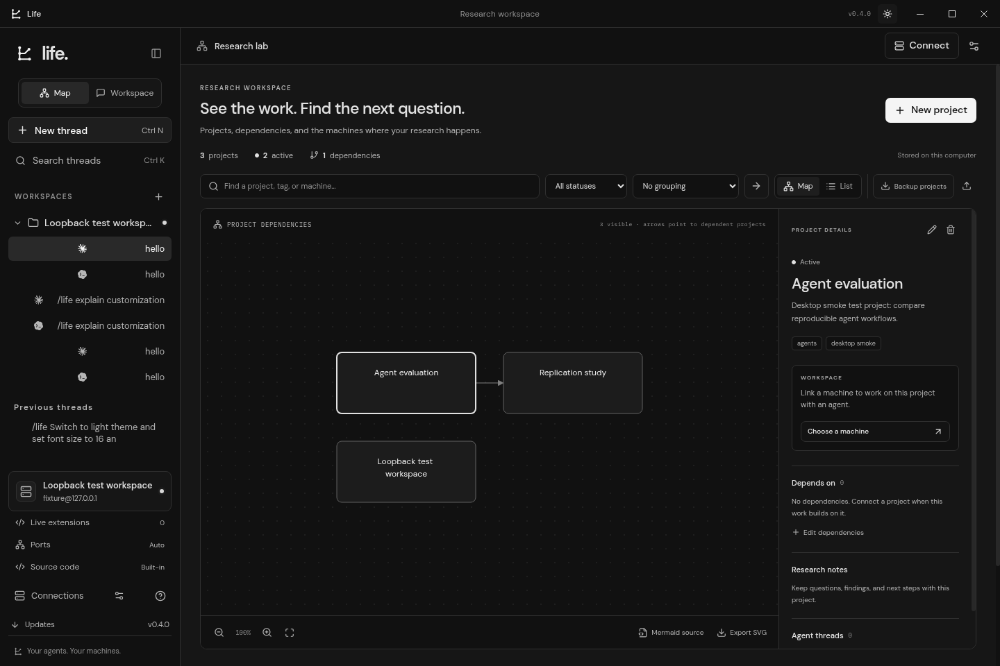
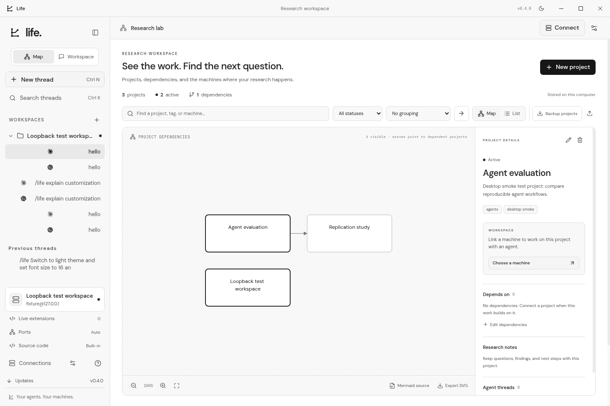

# Life

Life is an Electron research workspace for **Codex and Claude Code over SSH**, with an agent interface inspired by [T3 Code](https://github.com/pingdotgg/t3code), a Mermaid project map, and prompt-driven customization.



Download installers from [GitHub Releases](https://github.com/greatitself/life/releases/latest). Windows uses a `.exe` installer; macOS uses DMG; Linux supports AppImage and Debian packages. Builds are unsigned.

## Upgrade your installed Life

If you installed **0.1.0**, run the new Windows `.exe` once. It upgrades the existing installation and preserves profiles, pinned SSH fingerprints, and conversation history. Keep the same installation location. You do not need to uninstall Life.

From **0.2.2**, open **Updates** to check, download, and restart into subsequent releases, including **0.4.0**. Windows and Linux AppImage support in-app updates. Unsigned macOS and Debian installations use the latest installer. Windows CI installs the actual 0.1.0 release, upgrades it, and checks that the installation identity and saved data survive. Local source revisions and extension files remain in Life’s data directory when the installer updates.

## Two views, two monochrome themes

- **Research map:** Track projects, hypotheses, notes, tags, status, and dependencies. Link projects to saved SSH workspaces and agent threads. Switch between Mermaid graph and list views, filter and search, group by status or machine, change direction, zoom, and export SVG or Mermaid source. JSON backups preserve all project data and can be imported later.
- **Agent workspace:** Chat with Codex or Claude Code, review approvals and questions, browse remote files, inspect Git changes, and use an interactive terminal. Threads retain their original provider and resume remote sessions after reconnecting.
- **Dark and light:** Neutral black, white, and gray surfaces. Theme changes apply to diagrams and the terminal. Windows has rectangular controls on the right; macOS uses native traffic lights. Official Codex and Claude marks come from [SVGL](https://github.com/pheralb/svgl), with its MIT notice bundled in installers.



## Tell Life to change itself

Ask Life from any existing Codex or Claude Code thread. Use `/life`, `@life`, or name Life explicitly so it can distinguish changes to the application from changes to your connected project. The composer shows the current scope; use `/project` or the scope control to return to project work. There is no separate customization conversation or prompt button.

Common settings work offline in the same thread:

- “/life switch to light theme and use a compact layout.”
- “Life, set font size to 16.”
- “/life hide the workspace panel.”

A connected Codex or Claude Code agent can edit Life’s actual **React, TypeScript/TSX, shared code, and CSS**, add npm dependencies, change settings, and create executable extensions. It uses the same thread and provider session, including follow-up questions. Life supplies exact source files when the agent requests them, stages the proposed edits, and compiles them locally with bundled npm and esbuild. You do not need a separate Node.js installation to customize the installed application. Adding packages requires access to the npm registry.

Successfully compiled source becomes the active interface after a reload. Life saves the conversation before reloading and retains local workspace data. Failed builds leave the working interface active and return their diagnostics to the same agent for up to two repair attempts; one request can make up to six automatic source-read round trips. Revision checks reject proposals based on stale source. Explanations, clarification questions, and replies proposing no changes remain ordinary chat messages.

Open **Settings** for configuration undo, reset, and reload. Click **Source code** below **Ports** in the sidebar to open **Life source**, inspect or edit files, compile and reload, restore the previous revision, use the built-in interface, or open the source folder. The local `life.config.json` file also reloads when edited externally. See [source customization](docs/source-customization.md) for the workflow and supported dependencies.

**Live extensions** go further: prompts can generate executable UI and behavior, including new views, CSS changes to the existing interface, or replacements for the entire workspace. Renderer extensions run in isolated frames and use the Life bridge to access connections, agents, files, settings, and their own backend. Backend extensions run in terminable Node workers and can use local files, commands, and Node modules with your user permissions. Enable, disable, edit, reload, and roll back extensions without rebuilding the app. The built-in workspace remains accessible through the recovery control and **Ctrl/Cmd + Shift + L**.

Extensions and source revisions are stored in Life’s local data directory. When an app update changes the built-in source baseline, Life preserves custom files and starts with its built-in interface. Ask `/life update my customization for this Life version` to rebuild against the new baseline; unchanged files refresh automatically while your edits remain available to the agent. Renderer and shared source can change immediately; the native Electron host, preload bridge, and recovery loader remain the installed copy. Backend extensions can implement new local behavior, and advanced agent calls accept provider-specific options. Changes to Electron/native binaries or installer signing need a packaged release.

The existing select controls remain unchanged so you can test customization yourself. For example, ask “/life replace Life’s model dropdown with a shadcn Select.” The agent can add actual React component source and required npm dependencies through the live source workflow. Tailwind v4 styles also compile when the proposal includes `tailwindcss`, `@tailwindcss/postcss`, `postcss`, and the stylesheet directives. Changing styles alone does not install the requested component library.

## Release signing

Signing is deferred until publisher credentials are available. Current Windows and macOS installers remain unsigned, and platform trust warnings may still appear. See [signing setup](docs/signing.md) for trusted Windows signing, macOS Developer ID signing and notarization, and Linux distribution details. Signing does not guarantee immediate Windows SmartScreen reputation.

## Connect a research machine

1. Click **Connect a machine** or **Connect** on the map.
2. Select a host from your local `~/.ssh/config`, or enter connection details manually. You can choose another config file.
3. Use a local private key, SSH agent, or password. Encrypted private keys accept a passphrase.
4. Verify and accept the target machine’s SSH fingerprint on its first connection.
5. After the machine connects, choose a remote project folder. Browse its directories or enter a path such as `~/projects/research`. You can choose a project later or switch folders from the workspace header.
6. Select an agent, model, and permission mode, then send a prompt.


Life shows OpenSSH’s resolved options, including `Include` files, `HostName`, `User`, `Port`, `IdentityFile`, `IdentityAgent`, algorithms, keepalives, and `ProxyJump`. Saved aliases resolve again when connecting. Reading config requires the local OpenSSH client; Windows users can install **OpenSSH Client** from Optional Features.

Jump hosts use OpenSSH with key/agent authentication and must already be trusted in OpenSSH `known_hosts`. Life verifies and pins the final target separately. Unsupported features such as `ProxyCommand`, certificate/hardware-key providers, configured forwarding, and local commands are reported explicitly. Life does not import OpenSSH’s target trust or reuse multiplexed sessions.

Profiles save connection details, key **paths**, and the last selected project. Passwords, passphrases, and key contents are never saved. A changed pinned target fingerprint fails the connection. One SSH connection is active at a time; multiple agent threads can use it. Connecting does not require a project folder, and automatic forwarding starts before project selection. Threads keep their original project so switching folders cannot silently move their coding work.

## Automatic port forwarding

Automatic forwarding is enabled by default. While connected over SSH, Life checks for TCP services listening on loopback or all interfaces, on ports 1024 and above, and exposes up to 32 of them on `127.0.0.1` on your computer. Open **Ports** to see the remote-to-local mappings, copy an address, or open a web service in your browser. If a matching local port is occupied, Life selects an available port and shows it in the list.

Turn off **Automatic port forwarding** in the Ports panel to close its tunnels. This preference survives restarts. You can also say “/life turn off automatic port forwarding” in any thread. Disconnecting closes the tunnels; reconnecting discovers services again when forwarding is enabled. Linux discovery uses `ss` or `lsof`, and macOS uses `lsof`.

## Prepare the remote agents

Install and authenticate either or both CLIs **on the remote Linux or macOS machine**:

```bash
npm install -g @openai/codex
codex login --device-auth
```

```bash
curl -fsSL https://claude.ai/install.sh | bash
claude auth login
```

Life starts the installed CLI through SSH, using its remote account and configuration. Codex uses its [app-server protocol](https://developers.openai.com/codex/app-server/); Claude uses its [streaming CLI](https://code.claude.com/docs/en/headless). The login shell must find the CLIs; Life also checks standard local CLI installation paths. Use the terminal for setup, then reconnect to refresh detection.

Life discovers models from the connected Codex or Claude Code CLI. Reasoning-effort and speed controls follow the selected model’s advertised capabilities; supported choices are saved per thread. Changing models clears unsupported choices to the provider default, and Life never selects a paid fast tier automatically. Availability still depends on the remote CLI version, account, and managed policy. Older providers without capability metadata retain a default choice.

**Review actions** surfaces approval requests, **Allow edits** allows workspace edits, and **Plan only** selects the provider’s planning/read-only behavior. Advanced source or extension features can pass validated Codex thread/turn options or Claude settings/arguments through the `providerOptions` input to `agent.start`. Life retains control of its session, project directory, streaming format, and approval plumbing.

Remote text previews are limited to 1 MB and confined to the connected project, including resolved symbolic links. Git shows tracked changes against `HEAD` and lists untracked files. Conversation history and project maps are stored locally.

## Run and build

Use Node.js **22.12 or newer**:

```bash
npm install
npm run dev
```

```bash
npm run build
npm start
npm run dist
```

Installers appear in `release/`. Build on the target platform. `npm run dev:web` provides a browser preview at `http://localhost:5173`; SSH, native updates, executable backend extensions, and local source compilation require Electron. Development from this checkout needs Node.js; source customization inside an installed Life uses its bundled tools.

Pushing a version tag runs verification, builds Windows x64, Linux x64, and both macOS architectures, tests Windows upgrades, and publishes installers, updater metadata, blockmaps, and SHA-256 checksums.

## Verify changes

```bash
npm run typecheck
npm test
npm run build
npm run test:desktop
npm run format:check
```

The desktop smoke test launches real Electron with isolated temporary data and a loopback SSH server. On Linux it uses Xvfb when needed. Protocol tests use deterministic Codex/Claude fixtures, avoiding paid inference; real authenticated model inference requires your remote machine. Extension tests exercise real Node workers and runtime recovery. Source tests exercise the actual compiler and revision/rollback behavior. Windows CI verifies the old installer upgrades to the new one.

| Action                     | Shortcut             |
| -------------------------- | -------------------- |
| New thread                 | Ctrl/Cmd + N         |
| Search threads             | Ctrl/Cmd + K         |
| Connections                | Ctrl/Cmd + ,         |
| Toggle terminal            | Ctrl/Cmd + backtick  |
| Toggle sidebar             | Ctrl/Cmd + B         |
| Recover built-in workspace | Ctrl/Cmd + Shift + L |
| Send message               | Enter                |
| Insert a line break        | Shift + Enter        |

The built-in renderer has no Node integration. Validated IPC keeps SSH and local key access in the main process. Executable extensions are separate, intentional local code; their frames remain sandboxed while backend workers have local user permissions.
