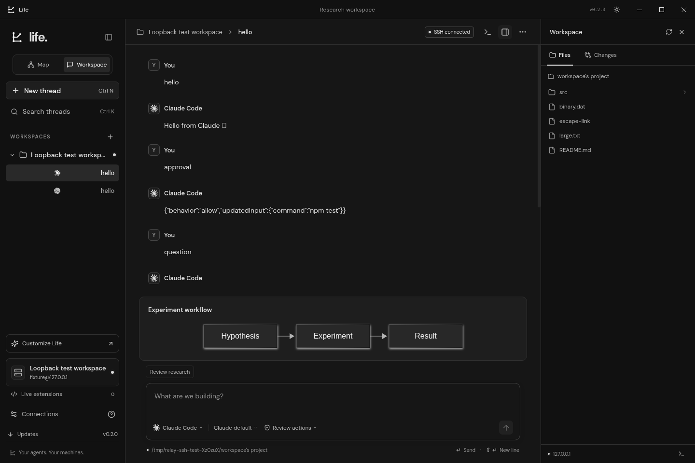
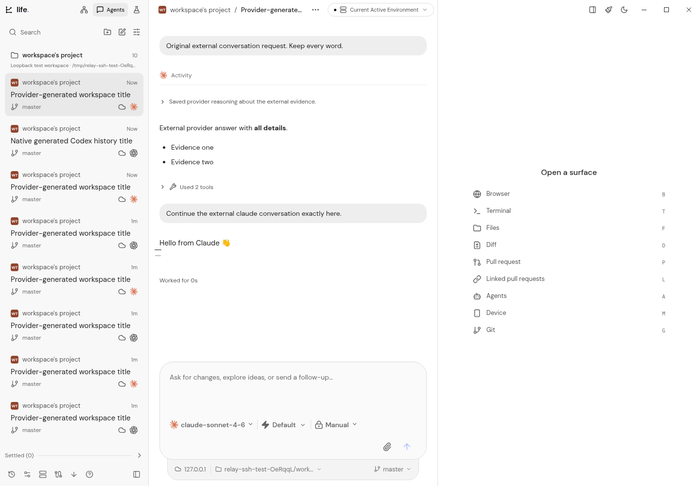
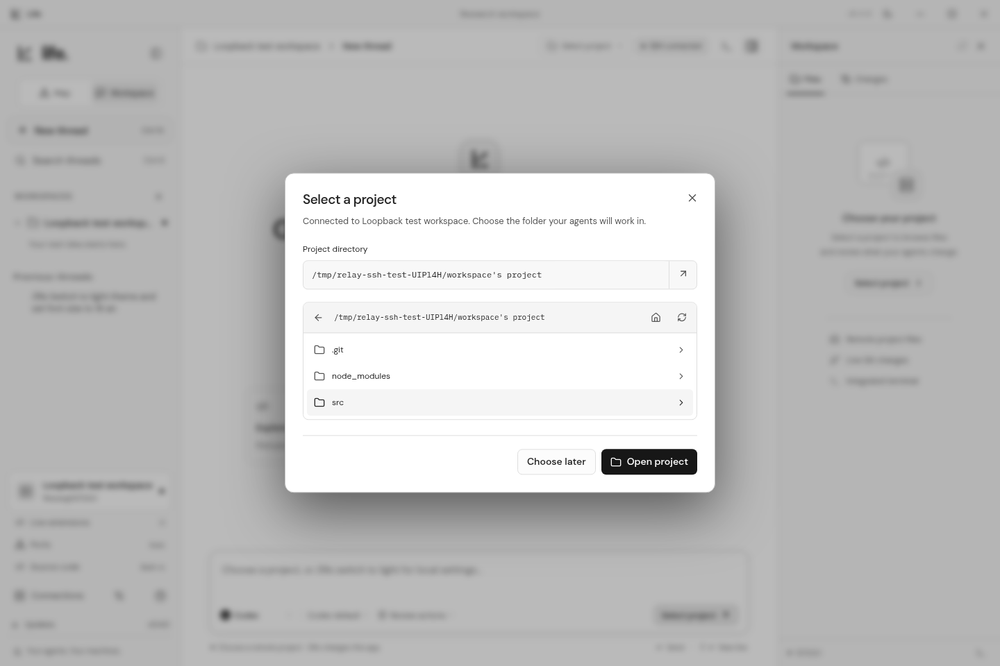

# Life

Life is an Electron desktop research workspace for **Codex and Claude Code**, with SSH connections, an agent interface inspired by [T3 Code](https://github.com/pingdotgg/t3code), a separate Research workspace, and **Life Studio** for prompt-driven application customization.



Desktop installers are included in the [v0.11.0 release](https://github.com/greatitself/life/releases/tag/v0.11.0). Windows uses a `.exe` installer; macOS uses DMG; Linux supports AppImage and Debian packages. Builds are unsigned.

## Upgrade your installed Life

If you installed **0.1.0**, run the new Windows `.exe` once. It upgrades the existing installation and preserves profiles, pinned SSH fingerprints, and conversation history. Keep the same installation location. You do not need to uninstall Life.

From **0.2.2**, open **Updates** to check, download, and restart into subsequent releases, including **0.11.0**. Windows and Linux AppImage support in-app updates. From 0.11.0, updates prepare in the background by default; turn off **Download updates automatically** to choose when to download. Restart remains your choice. Unsigned macOS and Debian installations use the latest installer. Windows CI upgrades only from the latest preceding published release, **0.10.0** for this release, and measures installation/upgrade time while checking that installation identity and saved data survive. Local source revisions and extension files remain in Life’s data directory when the installer updates.

Life 0.11 packs dependencies into Electron's archive to reduce installer disk work, prepares Studio's bundled compiler files only when needed, and reduces repeated rendering during streaming, thread navigation, sidebar input, and graph movement. See the [0.11.0 release notes](docs/release-notes-v0.11.0.md) for the changes and measured Windows installation results.

Life 0.8 includes all **37 incorporated customizations**: the 27 earlier workspace changes and 10 additions from the October 9 backup. They are installed features with individual enable, disable, delete, and restore controls. Exact matching old source layers remain exportable archives; unrelated or subsequently edited extensions are preserved. See the [incorporation audit](docs/backup-incorporation-2026-10-09.md) and [release notes](docs/release-notes-v0.8.0.md).

## Workspaces and monochrome themes

- **Research:** Manage goals, problems, notes, artifacts, and editable maps in the connected machine's `~/.life/research` directory. Research conversations have their own scope and stay out of Agents project lists. They work without selecting an Agents project. Goal overviews and individual problems use separate working directories, with native instruction files and structured context identifying the selected goal and problem. Each goal supports HTML, Mermaid, JSON, or automatic maps, with a resizable conversation panel, saved drafts, search, and filters. The project map also retains project status, tags, dependencies, and diagram export.
- **Agents:** A resizable project-grouped thread rail, open conversation area, and wide diff pane bring the layout closer to T3 Code. The new-thread prompt opens the project picker through its dashed-underlined project name, and **Current Active Environment** in the header shows the machine, connection, folder, and installed providers. Search, filter, sort, snooze and settle threads; attach files or images; navigate messages; and choose Browser, Terminal, Files, Diff, Git and pull-request surfaces. Threads restore their own project, use provider-generated titles, and show reasoning, tools, and subagent activity in order. While a turn runs, the yellow Send button and Enter steer the response; Tab queues a follow-up for completion. Model, reasoning, and speed menus remain usable while the provider works.
- **Dark and light:** Neutral black, white, and gray surfaces. Theme changes apply to diagrams and the terminal. Windows has rectangular controls on the right; macOS uses native traffic lights. Official Codex and Claude marks come from [SVGL](https://github.com/pheralb/svgl), with its MIT notice bundled in installers.

Fresh installations open Agents. Use the header view controls for **Research** and the project map; existing saved view preferences are respected. See [conversations, environments, and host history](docs/conversations-and-research.md) for the detailed behavior.

Open **Usage** in the header for native token totals, cache/reasoning breakdowns, reported context usage, and provider cost estimates across retained sessions. Filter by machine or provider and open a listed conversation. Account limits and reset times belong to the connected machine; refresh them with **Refresh limits**. Missing costs and quota data remain explicitly unreported.

Open **Provider updates** beside Usage to compare the connected machine's installed Codex and Claude Code versions with published releases. Background checks and **Check for updates** refresh the versions and show newer-release notices. Follow the linked instructions for that machine's installation method and channel. The separate **Updates** controls update Life itself. See the [0.10.0 release notes](docs/release-notes-v0.10.0.md) and [frontier alignment audit](docs/frontier-alignment-v0.10.0.md) for the behavior changes and validation scope.



## Research methods and evidence

Research supports a trace from requirements and blockers to candidate solutions, interactions, and verification. **Anti-abstraction** decomposes a whole into constituent parts; **abstraction** composes parts into a higher-level whole. **Grounding** separately records the evidence, constraints, and assumptions supporting a claim. A cited source or proposed solution does not become a verified result automatically.

The 12 approaches are Explore, Anti-abstraction, Abstraction, Grounding, Constructive interference, Counterfactual, Analogy transfer, Constraint inversion, Reverse design, Morphological search, Causal intervention, and Verification. Each produces inspectable records linked by stable IDs. Describe the desired research approach in your prompt. Each submitted request has its own immutable invocation file; the native method guide and schema supply context without adding words to your message. See the [research methodology](docs/research-method.md) for the workbench, evidence states, composition, and testing workflow.

## Customize Life in Life Studio

Open the **Customize** paintbrush button in the header to launch Life Studio in a dialog. It has separate customization conversations, provider controls, and an inspector for **Details**, **Changes**, **Build**, and **Recovery**. Ask naturally, for example “Replace the model dropdown with a shadcn Select,” or “Add a research-review page with saved notes.” Ordinary Agents and Research chats do not apply application proposals; `/life` is sent to their provider as the literal text you typed.

Studio can change actual **React, TypeScript/TSX, shared source, CSS, npm dependencies, settings, and runtime extensions**. Common settings such as theme and font size work offline. Larger changes use a connected Codex or Claude Code agent, without requiring an Agents project. Life places its source context and proposal schemas in a private Studio workspace's `AGENTS.md`, `CLAUDE.md`, and `.life/*.json` files. It sends your message unchanged, including during bounded source-reading and repair continuations.

**Apply valid changes automatically** is on by default. Turn it off to inspect a completed proposal and choose **Apply** or **Discard**. Source changes compile locally using bundled npm and esbuild, then reload the interface with Studio history preserved. Failed builds leave the working interface active and show their diagnostics. Each change becomes an independently managed extension. No separate local Node.js installation is needed; new npm packages require network access.

Inside Customize, open **Manage and share extensions** to manage custom source and runtime extensions and the incorporated built-in features. Disabling or deleting a built-in feature persists its choice without erasing chats, research files, or the installed recovery code; deleted features can be restored. Built-ins use feature controls rather than replaying old backup patches. Custom source layers still need to compose and compile, and incompatible changes keep the previous working build active.

Studio's **Recovery** tab can restore the previous source revision or use the installed interface. **Ctrl/Cmd + Shift + L** remains available through the native host. Live changes cover renderer/shared source and supported backend workers; changes to the Electron host, preload bridge, native binaries, or installer signing require a packaged update. See [Life Studio and source customization](docs/source-customization.md) for context files, build controls, dependencies, sharing, and recovery.

## Your words stay your words

Life preserves the text of every submitted message. It does not append research instructions, source files, attachment explanations, or hidden title requests to your coding conversation. User-selected attachments travel as native provider content where supported; otherwise Life supplies their visible uploaded paths as separate input blocks. Providers may still load their own project `AGENTS.md` or `CLAUDE.md` and account configuration.

Research instructions live in its own workspace files. Studio instructions and diagnostics live in its separate workspace files. Chat titles come from provider metadata or a separate, disposable title-generation task with the original message unchanged; title instructions never enter the coding thread. A title task may use the provider account's inference allowance. A failed title task leaves an untitled conversation usable.

## Continue existing chats from your machine

Open **Host chat history** after connecting to browse Codex and Claude Code conversations created outside Life. Search saved chat titles, filter by provider, refresh, and page through older sessions and messages. Preview tool results, reasoning, and saved subagents before choosing **Bring to Life**. Life copies display history and keeps the provider's existing session ID; browsing and importing do not rewrite the original provider records or send a coding prompt. Research sessions open in Research, while internal Studio and title jobs stay out of this list. A project selection is optional for browsing.

## Share a customization

Export a source or runtime extension as a portable bundle, or explicitly share one as a **public GitHub Gist**. Review its files, dependencies, and complete code before clicking **Publish publicly**. Publishing uses your GitHub token for that request; Life does not store it or add it to the bundle. Customizations remain local until you choose to publish them.

Bundles contain extension code and dependency metadata, without Life’s saved connections, conversation history, or settings. Code can still contain information you put into it, so inspect the preview before sharing. In **Manage extensions → Import**, enter a public Gist link, choose **Preview public extension**, review it, then choose **Install extension**. Fetching its preview does not execute the extension. See [source customization](docs/source-customization.md) for sharing and layer compatibility.

## Release signing

Signing is deferred until publisher credentials are available. Current Windows and macOS installers remain unsigned, and platform trust warnings may still appear. See [signing setup](docs/signing.md) for trusted Windows signing, macOS Developer ID signing and notarization, and Linux distribution details. Signing does not guarantee immediate Windows SmartScreen reputation.

## Connect a research machine

1. Click **Connect a machine** or **Connect** on the map.
2. Select a host from your local `~/.ssh/config`, or enter connection details manually. You can choose another config file.
3. Use a local private key, SSH agent, or password. Encrypted private keys accept a passphrase.
4. Verify and accept the target machine’s SSH fingerprint on its first connection.
5. After the machine connects, choose a remote project folder. Browse its directories or enter a path such as `~/projects/research`. You can choose a project later or switch folders from the workspace header.
6. Select an agent, model, and permission mode, then send a prompt.



Life shows OpenSSH’s resolved options, including `Include` files, `HostName`, `User`, `Port`, `IdentityFile`, `IdentityAgent`, algorithms, keepalives, and `ProxyJump`. Saved aliases resolve again when connecting. Reading config requires the local OpenSSH client; Windows users can install **OpenSSH Client** from Optional Features.

Jump hosts use OpenSSH with key/agent authentication and must already be trusted in OpenSSH `known_hosts`. Life verifies and pins the final target separately. Unsupported features such as `ProxyCommand`, certificate/hardware-key providers, configured forwarding, and local commands are reported explicitly. Life does not import OpenSSH’s target trust or reuse multiplexed sessions.

Profiles save connection details, key **paths**, and the last selected project. Passwords, passphrases, and key contents are never saved. A changed pinned target fingerprint fails the connection. One SSH connection is active at a time; multiple agent threads can use it. Connecting does not require a project folder, and automatic forwarding starts before project selection. Selecting a saved thread restores its original project on the current machine. Saved key, agent and SSH-config profiles can reconnect automatically; missing passwords or passphrases still require the connection dialog. Rapid navigation is serialized so an older request cannot send a prompt to the wrong project.

Unexpected SSH interruption leaves a running provider in a detached remote broker. Life retries the same machine using credentials held only in memory, then catches up from its output journal without resending the prompt. The remote host needs Node.js, `nodejs`, or Python 3 for this broker; no additional npm or pip package is needed. Explicit disconnect stops automatic reconnecting. Host shutdown, a terminated provider, or restarting the Life process is different from an SSH interruption; Life does not silently restart work. See [connection continuity](docs/conversations-and-research.md#connection-continuity).

Project browsing, selection and remote execution have deadlines and settle when the connection closes. Codex resumes request thread metadata without downloading its entire remote history; Life keeps the displayed conversation locally. Invalid or oversized provider frames report a transport error rather than silently turning into a login timeout. Large activity diffs use bounded previews with complete output available separately, and late React errors show a recoverable interface instead of an empty window. Native recovery remains available even when a renderer stops responding. Emergency extension recovery opens one review dialog and keeps SSH disconnected; saved threads remain available for normal selection afterward.

## Automatic port forwarding

Automatic forwarding is enabled by default. While connected over SSH, Life checks for TCP services listening on loopback or all interfaces, on ports 1024 and above, and exposes up to 32 of them on `127.0.0.1` on your computer. Open **Ports** to see the remote-to-local mappings, copy an address, or open a web service in your browser. If a matching local port is occupied, Life selects an available port and shows it in the list.

Turn off **Automatic port forwarding** in the Ports panel to close its tunnels. This preference survives restarts. You can also ask Life Studio to turn off automatic port forwarding. Disconnecting closes the tunnels; reconnecting discovers services again when forwarding is enabled. Linux discovery uses `ss` or `lsof`, and macOS uses `lsof`.

## Prepare the remote agents

Install and authenticate either or both CLIs **on the remote Linux or macOS machine**:

```bash
npm install -g @openai/codex
codex login --device-auth
```

```bash
curl -fsSL https://claude.ai/install.sh | bash
claude auth login
```

Life starts the installed CLI through SSH, using its remote account and configuration. Codex uses its [app-server protocol](https://developers.openai.com/codex/app-server/); Claude uses its [streaming CLI](https://code.claude.com/docs/en/headless). The login shell must find the CLIs; Life also checks standard local CLI installation paths. Use the terminal for setup, then reconnect to refresh detection.

Life discovers models from the connected Codex or Claude Code CLI. Reasoning-effort and speed controls follow the selected model's advertised capabilities; supported choices are saved per thread. They remain editable during a response and use provider controls without stopping the turn or inserting a message. Codex versions with live settings support apply changes at the next model step; older versions use the next turn. Claude model and effort changes apply at subsequent model requests, while its Fast mode changes on the next turn. The desktop controls update immediately without routine settings notices. Changing models clears unsupported choices to the provider default, and Life never selects a paid fast tier automatically. Availability depends on the CLI version, account, and managed policy.

The access menu uses each provider's native terminology and omits Plan: Codex offers **Ask for approval**, **Read-only**, **Approve for me**, and **Full access**; Claude Code offers **Manual**, **Accept edits**, **Auto**, **Don't ask**, and **Bypass permissions**. Advanced source or extension features can pass validated Codex thread/turn options or Claude settings/arguments through the `providerOptions` input to `agent.start`. Life retains control of its session, project directory, streaming format, and approval plumbing.

Remote text previews are limited to 1 MB and confined to the connected project, including resolved symbolic links. Git shows tracked changes against `HEAD` and lists untracked files. Agents and Research histories checkpoint atomically to `conversations.json` in Life's user-data directory, including during continuous streaming and before native close or reload. Existing browser history migrates automatically; a full browser cache cannot block disk saves. Restored queues stay paused, and original provider records remain unchanged. Project maps and separate Studio histories retain their local storage. See [saved conversations and recovery](docs/conversations-and-research.md#saved-conversations-and-recovery).

## Run and build

Use Node.js **22.12 or newer**:

```bash
npm ci
npm run dev
```

```bash
npm run build
npm run dist
```

Pushing a version tag verifies the desktop application and builds Electron installers for Windows x64, Linux x64, and macOS on Intel and Apple Silicon, including Windows upgrade checks.

To rebuild an existing release, dispatch the release workflow with its `tag` and the verified source commit in `source_ref`. All installers and release notes use that same commit, which is linked in the published notes. The source package version must match the release tag. Release assembly and Windows installer verification use the workflow revision, so older source revisions can be rebuilt with maintained checks. Only the latest preceding known published release is used as the upgrade baseline. Replacing a same-version installer requires a manual installation for users who already installed that version.

## Verify changes

```bash
npm run typecheck
npm test
npm run build
npm run test:desktop
npm run format:check
```

The desktop smoke test launches real Electron with isolated temporary data and a loopback SSH server. On Linux it uses Xvfb when needed. Protocol tests use deterministic Codex/Claude fixtures, avoiding paid inference; real authenticated model inference requires your remote machine. Extension tests exercise real Node workers and runtime recovery. Source tests exercise the actual compiler and revision/rollback behavior. Windows CI verifies that the latest preceding release upgrades to the new installer.

| Action                     | Shortcut             |
| -------------------------- | -------------------- |
| New thread                 | Ctrl/Cmd + N         |
| Search threads             | Ctrl/Cmd + K         |
| Connections                | Ctrl/Cmd + ,         |
| Toggle terminal            | Ctrl/Cmd + backtick  |
| Toggle sidebar             | Ctrl/Cmd + B         |
| Recover built-in workspace | Ctrl/Cmd + Shift + L |
| Send message               | Enter                |
| Insert a line break        | Shift + Enter        |

The built-in renderer has no Node integration. Validated IPC keeps SSH and local key access in the main process. Executable extensions are separate, intentional local code; their frames remain sandboxed while backend workers have local user permissions.
